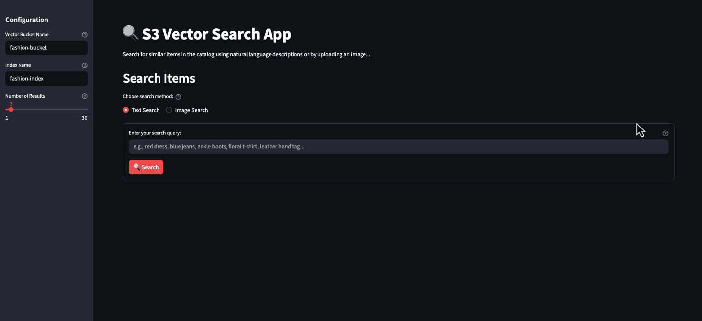

# Amazon S3 Vectors Fashion Products Search

A comprehensive demonstration of Amazon S3 Vectors capabilities using the Fashion Product Images Dataset from Kaggle. This project showcases how to build a semantic search application that can find similar fashion items using both text descriptions and image uploads.

## 🎯 Project Overview

This project demonstrates 3 main components that work together to showcase the system's core functionality:

1. **Dataset Generation**: Process fashion products & images to create embeddings using Amazon Bedrock's Titan multimodal model
2. **Vector Storage & Indexing**: Create S3 vector bucket and index to store and organize the embeddings efficiently
3. **Semantic Search**: Query the vector database using natural language text or image uploads through an intuitive Streamlit interface

## Demo



## 🏗️ Architecture

```
Fashion Dataset (Kaggle)
    ↓
Generate Embeddings (Bedrock Titan)
    ↓
Store in S3 Vectors (Cosine Similarity Index)
    ↓
Streamlit UI (Text/Image Search)
```

## 📁 Project Structure

```
├── .env                                   # Environment configuration
├── requirements.txt                       # Python dependencies
├── generate_fashion_dataset_parallel.py   # Generate embeddings from fashion dataset
├── ingest_fashion_vectors.py              # Create S3 vector bucket/index and ingest data
├── utils.py                               # Helper functions for embeddings and search
├── streamlit_app.py                       # Main Streamlit web application
├── run_streamlit.sh                       # Script to launch the Streamlit app
└── README.md                              # This file
```

## 🚀 Getting Started

### Prerequisites

- AWS Account with appropriate permissions for:
  - Amazon Bedrock (Titan model)
  - Amazon S3 Vectors
  - S3 (for dataset storage although not a must)
- Python 3.8+
- Fashion Product Images Dataset from Kaggle
  - You can download from here [Fashion Product Images Dataset](https://www.kaggle.com/datasets/paramaggarwal/fashion-product-images-dataset)
  - Contains two csv files (styles.csv, images.csv) and images folder
  - You can host the two csv locally or on S3 bucket
  - **The images are publicly hosted by Kaggle so it's not required to download the entire dataset only the two csv files!**
  - An alternative aproch can also copy the images manually to your bucket and use them from your bucket but this is not neceserry (using DATASET_IMAGES_LOCATION)
- **Where to run this code?**
  - This is meant to be run locally from your PC or on EC2
  - The Streamlit application uses port 8501
  - There are also instuctions how to build an image with the Steamlit application in which you can deploy to ECS/EKS

### Installation

1. **Clone and navigate to the project**:

   ```bash
   cd sample-s3-vectors-fashion-products
   ```

2. **Install dependencies**:

   ```bash
   pip install -r requirements.txt
   ```

3. **Configure environment variables**:
   Edit the `.env` file with your settings:

   ```bash
   # Image location: WEB (Kaggle hosted) or S3 (your S3 bucket)
   DATASET_IMAGES_LOCATION=WEB

   # Path to dataset CSV files (local or S3)
   DATASET_CSV_PATH=s3://your-dataset-bucket

   # Parallel processing workers (adjust based on your system)
   MAX_WORKERS=50

   # S3 Vector configuration
   S3_VECTOR_BUCKET_NAME=fashion-bucket
   S3_VECTOR_INDEX_NAME=fashion-index
   ```

4. **Set up AWS credentials and permissions**:

   Configure your AWS credentials:

   ```bash
   aws configure
   # or use IAM roles.
   ```

   Ensure your AWS user/role has the following IAM policy attached:

   ```json
   {
     "Version": "2012-10-17",
     "Statement": [
       {
         "Effect": "Allow",
         "Action": ["bedrock:InvokeModel"],
         "Resource": [
           "arn:aws:bedrock:*::foundation-model/amazon.titan-embed-image-v1"
         ]
       },
       {
         "Effect": "Allow",
         "Action": [
           "s3vectors:CreateVectorBucket",
           "s3vectors:CreateIndex",
           "s3vectors:PutVectors",
           "s3vectors:QueryVectors"
         ],
         "Resource": "*"
       },
       {
         "Effect": "Allow",
         "Action": ["s3:GetObject"],
         "Resource": ["arn:aws:s3:::your-dataset-bucket/*", "arn:aws:s3:::*"]
       }
     ]
   }
   ```

   **Note**: Replace `your-dataset-bucket` with your actual S3 bucket name containing the dataset. The S3 permission is only needed if you're using S3 for dataset storage (`DATASET_CSV_PATH=s3://...`) or image hosting (`DATASET_IMAGES_LOCATION=S3`).

## 📊 Usage

### Step 1: Generate Dataset with Embeddings

Process the Fashion Product Images Dataset to create embeddings:

```bash
python generate_fashion_dataset_parallel.py
```

This script:

- Reads the fashion dataset CSV files (`styles.csv`, `images.csv`)
- Generates 1024-dimensional embeddings for each product image using Bedrock Titan Multimodal embeddings
- Uses parallel processing for faster execution
- Processes ~44,000 images with configurable parallel workers
- **Should take approximately 16 minutes with MAX_WORKERS=50**
- Outputs a `dataset.csv` file with embeddings
- **Some rows/images might fails with error and will be ignore/skippped:**
  - An error occurred (ValidationException) when calling the InvokeModel operation: 400 Bad Request: Image exceeds max pixels allowed
  - Error processing row 36383 with path 'undefined': [Errno 2] No such file or directory: 'undefined'
  - (Caused by ConnectTimeoutError(<urllib3.connection.HTTPConnection object at 0x361c91990>, 'Connection to assets.myntassets.com timed out. (connect timeout=None)'))

### Step 2: Create S3 Vector Index and Ingest Data

Set up the vector database and load your embeddings:

```bash
python ingest_fashion_vectors.py
```

This script:

- Creates an S3 vector bucket (if it doesn't exist)
- Creates a cosine similarity index with 1024 dimensions
- Ingests all product embeddings with metadata (category, color, season, etc.)
- Processes data in batches for optimal performance
- Some rows (with no embeddings) will be skipped and printed to output
- **Should take approximately 6 minutes with the deafult batch (can be adjust by setting NUM_VECTORS_PER_PUT)**

### Step 3: Launch the Streamlit Application

Start the interactive search interface:

```bash
./run_streamlit.sh
```

- This is meant to be run locally on your PC or on EC2.
- The Streamlit application uses port 8501.
- There are also instructions how to build an image with the Streamlit application in which you can deploy to ECS/EKS

## 🐳 Deployment as a container image ECS/EKS/EC2

A Dockerfile is provided to containerize the Streamlit application. Build the image using:

```bash
docker build -t s3-vector-fashion-app .
```

- Exposes port 80
- The built image can be deployed to Amazon ECS or EKS. Deployment instructions for these services are not included in this repo.

## 🔍 Features

### Text-Based Search

- Enter natural language descriptions like "red dress", "blue jeans", "ankle boots"
- Uses Bedrock Titan to convert text to embeddings
- Finds semantically similar fashion items

### Image-Based Search

- Upload product images (PNG, JPG, JPEG)
- Generates embeddings from uploaded images
- Returns visually similar items from the catalog

### Rich Metadata Display

- Product names and descriptions
- Categories (gender, master category, sub category)
- Attributes (color, season, usage, year)
- Similarity scores
- Product images (from Kaggle or S3)

### Performance Metrics

- Real-time query execution times
- Configurable result count (1-30 items)
- Sorted results by similarity score

## ⚙️ Configuration Options

### Dataset Image Location

- **WEB**: Uses Kaggle-hosted public image URLs (default, no additional storage needed)
- **S3**: Requires uploading ~15GB of images to your S3 bucket for faster access

### Performance Tuning

- **MAX_WORKERS**: Adjust parallel processing based on your CPU cores and memory
- **NUM_VECTORS_PER_PUT**: Batch size for vector ingestion (default: 100)

## 🔧 Technical Details

### Embedding Model

- **Amazon Titan Embed Image v1**: Multimodal model supporting both text and images
- **Dimensions**: 1024 (configurable to 384 or 256)
- **Input Limits**: Images up to 2048x2048 pixels, text up to 128 tokens

### Vector Index Configuration

- **Distance Metric**: Cosine similarity
- **Data Type**: float32
- **Metadata**: Rich product attributes for filtering and display

### Search Performance

- Typical query times: 200-1000ms
- Supports up to 30 results per query
- Batch processing for efficient ingestion

## 🛠️ Troubleshooting

### Common Issues

1. **AWS Permissions**: Ensure your AWS credentials have access to Bedrock, S3 Vectors, and S3
2. **Memory Usage**: Reduce MAX_WORKERS if you encounter memory issues during dataset generation
3. **Embedding Errors**: Some images may fail to process - the script will skip them and continue

## 📈 Dataset Information

The Fashion Product Images Dataset includes:

- **~44,000 fashion products** with images and metadata
- **Categories**: Men's, Women's, and Kids' fashion items
- **Attributes**: Product type, color, season, usage, brand information
- **Images**: High-quality product photos from various angles
- **[Fashion Product Images Dataset](https://www.kaggle.com/datasets/paramaggarwal/fashion-product-images-dataset)**

## Security

See [CONTRIBUTING](CONTRIBUTING.md#security-issue-notifications) for more information.

## License

This library is licensed under the MIT-0 License. See the LICENSE file.
